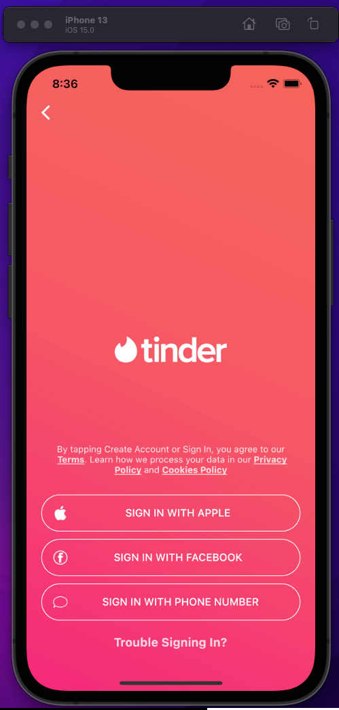

# mockup_tinder

Exercício de Leitura de Mockups da Flutterando Masterclass

## Como executar

Este projeto não utiliza pacotes / bibliotecas externas.

Dado que possua o flutter em uma versão maior ou igual a 2.12.0 e menor que 3.0.0, é necessário utilizar apenas o comando a seguir:
- `flutter run`

Segue uma captura de tela (screenshot) da execução no simulador (Iphone 13):

